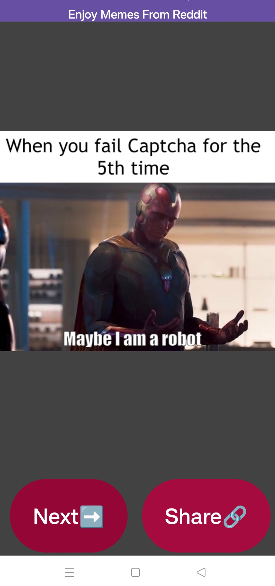
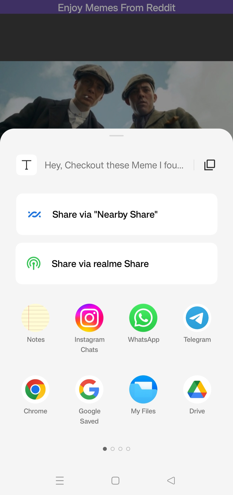
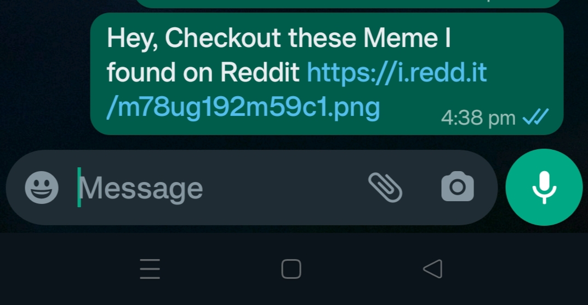

# Memes App

The Memes App is an Android application that fetches random memes from the Reddit API using Volley and displays them in a simple user interface. Users can share memes and navigate to the next one with the provided buttons.

## Features

- Fetches memes from Reddit API.
- Share memes with friends.
- Simple and intuitive user interface.

## Screenshots





## Technologies Used

- Android Studio
- Kotlin
- Volley Library
- Glide Library

## Getting Started

1. Clone the repository to your local machine.

    ```bash
    git clone https://github.com/your-username/memes-app.git
    ```

2. Open the project in Android Studio.

3. Build and run the app on an Android emulator or device.

## Usage

1. Launch the app.

2. Wait for memes to load. If a meme doesn't load, press the "Next" button.

3. Share memes using the "Share" button.

## Contributing

If you want to contribute to this project, feel free to fork the repository and submit a pull request. Contributions are welcome!

## License

This project is licensed under the MIT License - see the [LICENSE](LICENSE) file for details.

## Acknowledgments

- Thanks to Reddit for providing the API used in this project.
- [Volley Library](https://developer.android.com/training/volley) for making network requests.
- [Glide Library](https://github.com/bumptech/glide) for image loading.

## Contact

If you have any questions or suggestions, feel free to contact the project maintainer:

Your Name  
Your Email  
[Your GitHub Profile](https://github.com/your-username)
